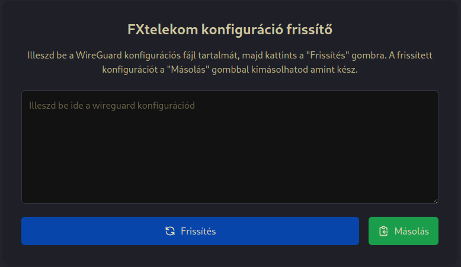
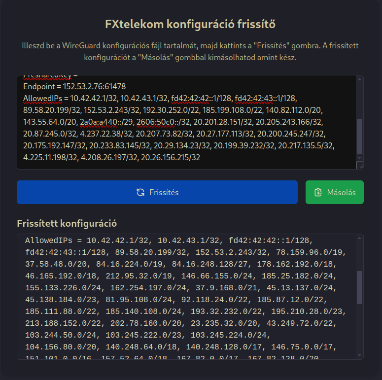
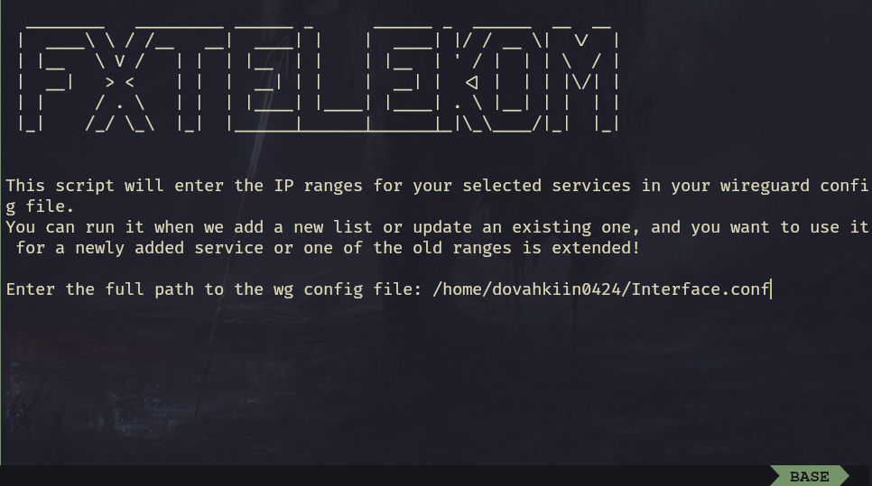
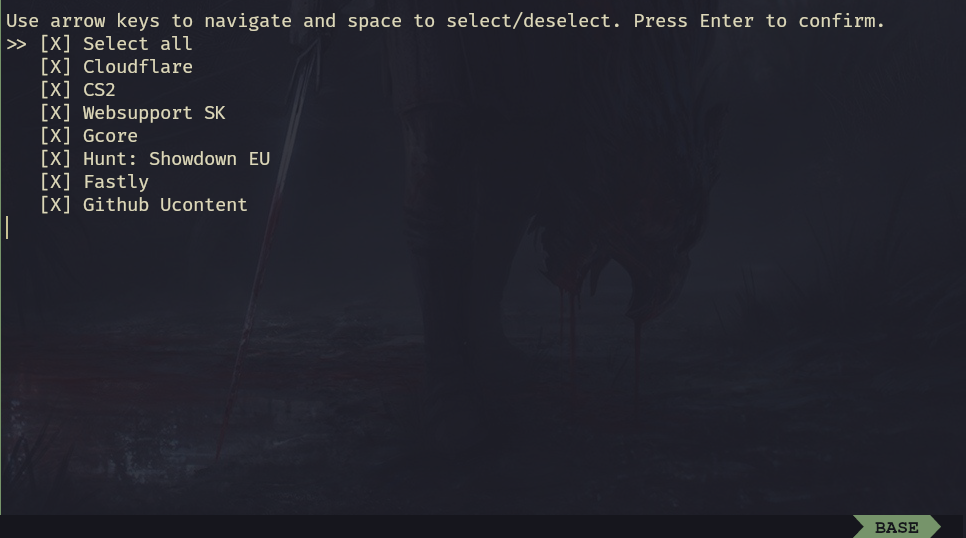
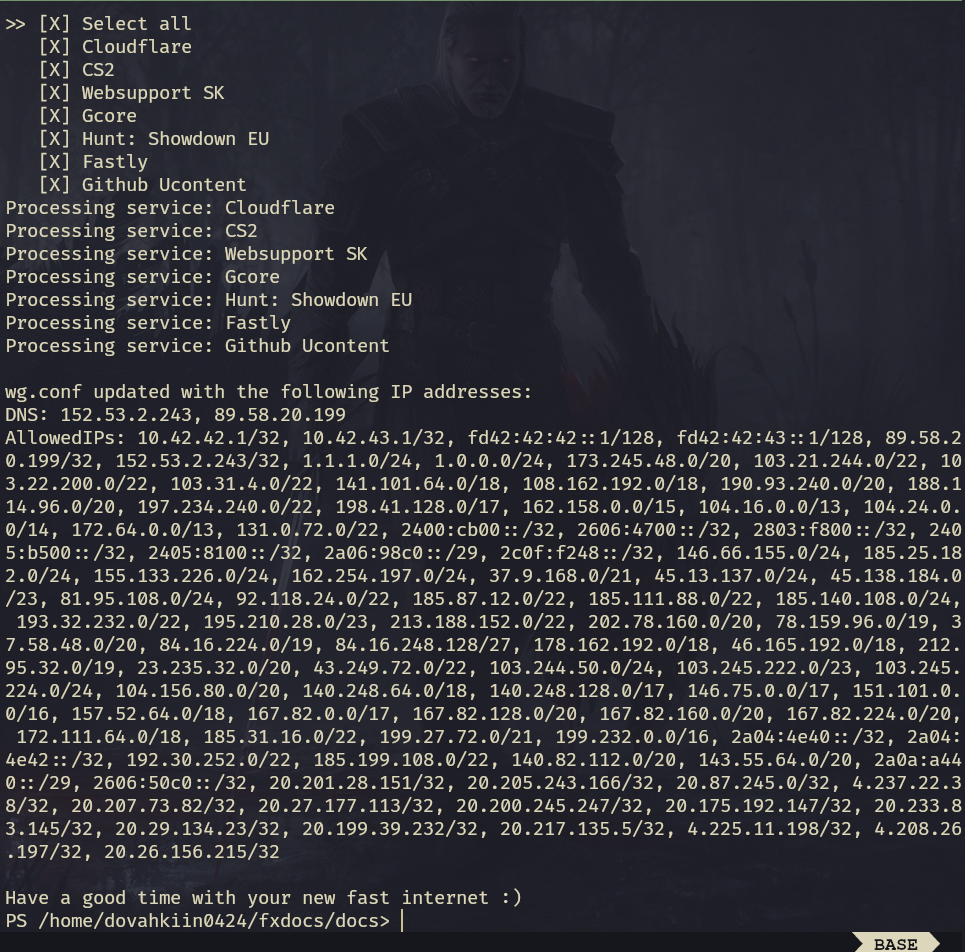

## Frissítés

Szolgáltatásunk folyamatos fejlesztés alatt áll, és frissül. Ez azzal jár, hogy amint bekerült egy új szolgáltatás kínálatunkba vagy egy meglévő lista bővül, kliens oldalon frissíteni kell a config fájlt.

!!! INFO
    Ezeket a frissítéseket látod a [`#changelog`]() szobában!

!!! DANGER "Fontos!"
    Bármelyik megoldást is alkalmazod; a végén törölnöd kell Wireguard-ból a configot, majd újra hozzáadni!

Ennek 3 módja van, kezdjük a legegyszerűbbel. Ez abban az esetben működik, ha például csak 2 tartomány bekerül valamelyik listába, vagy akár egy újba, például:
```
10.20.30.0/24, 20.30.40.0/24
```
Ezesetben nyugodtan megnyithatod a configod egy szövegszerkesztővel, és az `AlloweddIPs` sor végére (A sok ip után) odaírhatod őket.

Na, de a legtöbben nem szeretnétek a fájlban turkálni, erre van további két megoldás.

## Weblap

Az egyszerűbb megoldás a [frissítő weblap](https://update.fxtelekom.org/).

Ide nemes egyszerűséggel bemásolhatod a configod, és minden esetben az aktuális legfrissebb verziót fogod visszakapni, amit aztán elmenthetsz.





## Powershell script
!!! INFO
    Ez a guide windows felhasználóknak szól, de ez a megoldás is platformfüggetlen, akárcsak a többi!

Elsőre ez tűnhet a legijesztőbbnek, viszont ebben az esetben tényleg nem kell megnyitnod sem a configot. Egyszerűen nyiss egy powershell-t vagy win 11 esetén windows terminal-t, és másold be az alábbi sort:
```
iex "& { $(iwr -useb 'https://raw.githubusercontent.com/FXTELEKOM/IpUpdater/main/IpUpdate.ps1') }"
```

Miután elindult a program, csak kövesd az utasításokat!

1. Add meg az elérési útvonalat a configodhoz! (Windows-on nem így fog kinézni!)


2. A felugró menüben a nyíl billentyűkkel navigálva válszd ki, hogy mit szeretnél átküldeni a VPN-en! A szolgáltatás moduláris, bármilyen felosztásban használható.
!!! INFO
    A "Select All" menüponttal kiválaszthatsz mindent!

!!! DANGER "Vigyázz!"
    Ha ki szeretnél valamit választani, akkor `szóköz`t nyomj, csak a végén nyomj `enter`t!



Sikeres lefutás esetén hasonló kimenetet kell kapnod!
!!! INFO
    Ha piros szöveget látsz, ne habozz meglátogatni minket discordon!

